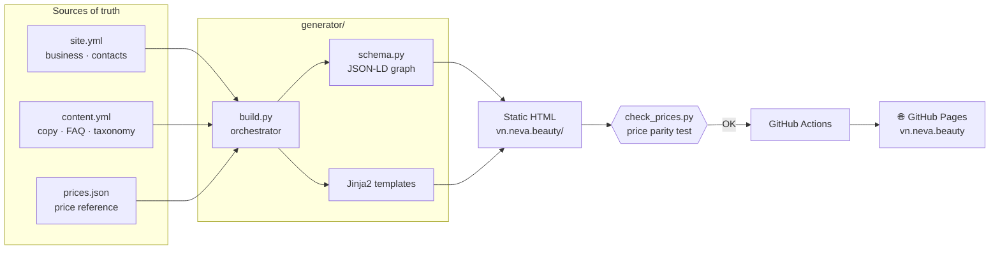

<p align="center">
  
</p>

<p align="center">
  <a href="README.md">🇷🇺 Русский</a> · <b>🇬🇧 English</b>
</p>

<p align="center">
  
  
  
  
  
  
</p>

<p align="center">
  🌐 <a href="https://vn.neva.beauty"><b>vn.neva.beauty</b></a> — live in production
</p>

---

## About

**Neva Beauty** is the website of a beauty and hardware-cosmetology center in
Da Nang, Vietnam. It serves Russian- and English-speaking clients: laser hair
removal, lifting and rejuvenation, body contouring and facial care.

Technically this is **not a CMS or a page builder**, but a custom static site
generator written in Python: content lives in YAML/JSON, templates are Jinja2, and
the output is clean static HTML served for free from GitHub Pages on a custom domain.
All content, SEO markup and prices are assembled from single sources of truth, and
price accuracy is guarded by an automated test.

<table>
  <tr>
    <td align="center" width="25%">
      <br>
      <sub><b>Body contouring</b></sub>
    </td>
    <td align="center" width="25%">
      <br>
      <sub><b>Lifting &amp; rejuvenation</b></sub>
    </td>
    <td align="center" width="25%">
      <br>
      <sub><b>Laser procedures</b></sub>
    </td>
    <td align="center" width="25%">
      <br>
      <sub><b>Skincare &amp; cosmetology</b></sub>
    </td>
  </tr>
</table>

---

## 🛠 Tech stack

| Area | Tools |
|---|---|
| **Language / build** | Python 3.12, custom generator `build.py` |
| **Templating** | Jinja2 (inheritance, macros, partials) |
| **Data** | YAML (`site.yml`, `content.yml`) + JSON (`prices.json`) |
| **SEO / AI data** | JSON-LD (schema.org) `@graph`, `sitemap.xml`, `llms.txt` |
| **Styling** | Plain CSS, cascade layers, minified into one bundle via `rcssmin` |
| **Fonts** | Self-hosted Cormorant + Manrope (woff2, cyrillic/latin subsets) |
| **Graphics** | SVG icons, `WebP` with `JPG` fallback, decorative canvas backdrop |
| **Testing** | `check_prices.py` — price-parity test on BeautifulSoup4 |
| **Analytics** | Yandex.Metrica |
| **CI/CD** | GitHub Actions → GitHub Pages, custom domain via `CNAME` |

---

## 🏗 Architecture

A single generator pass turns data into a finished site. Data, markup and prices are
separated and each has a single source of truth; the build is deterministic and
reproducible in CI.



---

## ✨ Engineering highlights

- **🎯 Single source of truth for content.** The service taxonomy is declared once in
  `content.yml`; from it the generator derives navigation, breadcrumbs, category hub
  pages and “See also” cross-linking — sections can’t drift out of sync by design.

- **💰 Price-accuracy guarantee.** `prices.json` is the only source of prices. After the
  build, `check_prices.py` parses the generated HTML and compares every price against
  the reference, failing on any mismatch. Prices are never invented or drifted.

- **🔎 Connected structured-data graph.** `schema.py` assembles one valid JSON-LD
  `@graph` (`Organization` + `BeautySalon` + `WebSite`), and pages append their own
  nodes: `Service`, `FAQPage`, `BreadcrumbList`, `ItemList`, and `AggregateOffer`
  (the price range is computed straight from the price list).

- **⚡ Performance — Lighthouse 100.** All CSS layers are concatenated into one minified
  `bundle.min.css` (one render-blocking request instead of six), fonts are self-hosted
  as subsets, and the LCP image is preloaded. Render-blocking was removed and the
  production score went from 75 to 100.

- **🌿 Preview and production from one build.** A `base_path` parameter prefixes asset
  links for a GitHub Pages sub-path preview and stays empty on the production domain —
  while SEO URLs are always absolute. `CNAME` is emitted into the artifact so the deploy
  never resets the custom domain.

- **🤖 `llms.txt` for AI assistants.** The generator publishes a machine-readable site
  map per the [llmstxt.org](https://llmstxt.org) standard — categories, services, contacts.

---

## 📁 Project structure

```
.
├─ generator/                 # Static site generator (Python)
│  ├─ build.py                #   build orchestrator
│  ├─ schema.py               #   JSON-LD (schema.org) assembly
│  ├─ check_prices.py         #   price-parity test
│  ├─ data/
│  │  ├─ site.yml             #   business, contacts, config
│  │  ├─ content.yml          #   copy, FAQ, taxonomy
│  │  └─ prices.json          #   price reference (source of truth)
│  └─ templates/              #   Jinja2 templates and partials
│
├─ vn.neva.beauty/            # Generated site (served by GitHub Pages)
│  ├─ index.html · <services>/ · <categories>/
│  ├─ assets/  css · js · fonts · icons · img
│  ├─ sitemap.xml · llms.txt · CNAME · 404.html
│
├─ .github/workflows/deploy.yml   # CI/CD: build and deploy
└─ requirements.txt
```

---

## 🚀 Run locally

```bash
# 1. Dependencies
python -m venv .venv && source .venv/bin/activate
pip install -r requirements.txt

# 2. Build the site into vn.neva.beauty/
python generator/build.py

# 3. Verify price accuracy
cd generator && python check_prices.py

# 4. Preview locally
cd ../vn.neva.beauty && python -m http.server 8000
# → http://localhost:8000
```

## ☁️ Deployment

Pushing to `main` triggers GitHub Actions: the workflow installs dependencies, runs
`build.py`, uploads the `vn.neva.beauty/` folder as an artifact and deploys to GitHub
Pages. The production domain `vn.neva.beauty` is wired up via `CNAME`.

---

## 🧭 Site content

**4 categories · 10 services**, pages generated automatically from the taxonomy:

| Category | Services |
|---|---|
| **Body contouring** | LPG massage · endosphere therapy · ultrasound cavitation |
| **Lifting & rejuvenation** | SMAS lifting · Morpheus 8 (RF) · M22 photorejuvenation |
| **Laser procedures** | laser hair removal · tattoo removal · permanent makeup removal |
| **Skincare & cosmetology** | aesthetic cosmetology and care |

---

<p align="center">
  <sub>Development and design — portfolio project. Procedure photos — center materials.</sub><br>
  <sub>Hero photo: Adrian Motroc / Unsplash.</sub>
</p>
