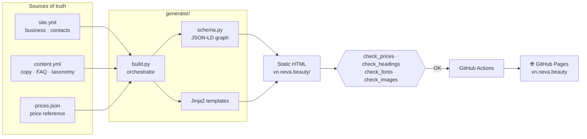

<p align="center">
  
</p>

<p align="center">
  <a href="README.md">🇷🇺 Русский</a> · <b>🇬🇧 English</b>
</p>

<p align="center">
  🌐 <a href="https://vn.neva.beauty"><b>vn.neva.beauty</b></a> — live
</p>

---

## A beauty center website that got 5.75× more messenger clicks

**Neva Beauty** is a beauty and hardware-cosmetology center in Da Nang, Vietnam:
laser hair removal, lifting and rejuvenation, body contouring and facial care.
Its clients are Russian-speaking people living in Vietnam; appointments only,
service in Russian and English.

The center used to run on a website builder: search engines barely found it, and
of the people who did land on it, almost none went on to write. This site was built
from scratch to fix both halves of that.

<table>
  <tr>
    <td align="center" width="25%">
      <br>
      <sub><b>Body contouring</b></sub>
    </td>
    <td align="center" width="25%">
      <br>
      <sub><b>Lifting &amp; rejuvenation</b></sub>
    </td>
    <td align="center" width="25%">
      <br>
      <sub><b>Laser procedures</b></sub>
    </td>
    <td align="center" width="25%">
      <br>
      <sub><b>Skincare &amp; cosmetology</b></sub>
    </td>
  </tr>
</table>

---

## 📈 What changed

Two periods of equal length: the old builder-based site and the new one.

**Messenger clicks — the headline:**

| Metric | Old site<br><sub>1 Apr — 7 May 2026</sub> | New site<br><sub>1 Aug — 6 Sep 2026</sub> |
|---|---|---|
| **Visits with a messenger click** | **8** | **46** |
| **Share of visits with a click** | **2.5 %** | **8.8 %** |
| Clicks through to WhatsApp and Telegram | 13 | 54 |

**5.75× more messenger clicks, and their share rose 3.5×.** The second number matters more
than the first: the site got three times better at turning a visitor into someone
who actually writes.

**Where the people came from:**

| Metric | Old site | New site |
|---|---|---|
| **Visits from search** | **30** | **256** |
| Search share of traffic | 9 % | 49 % |
| Total visits | 322 | 520 |
| Page views | 603 | 1,187 |
| Pages per visit | 1.87 | 2.28 |
| Time on site | 1:23 | 1:36 |

Search traffic grew 8.5× — search went from the smallest channel to the largest.

An honest caveat: paid ads ran during the new period and brought 86 visits
(16 % of traffic) — a third of what search delivered. Ads do not explain the growth:
even with them removed entirely, non-paid traffic still rose from 322 to 434.

Two metrics moved the wrong way. Bounce rate rose from 17 % to 25 % — previously
almost everyone arrived from social media already knowing the center, now half the
traffic is cold search. Click-throughs to social media fell from 8.4 % to 5.0 %: the
old site worked as a shop window people left to finish the conversation on Instagram,
whereas now they write directly.

<sub>Traffic and conversion figures come from the center's Yandex.Metrica: clicks are
counted by the "messenger click" auto-goal, which catches clicks on every WhatsApp and
Telegram link and was active across both periods. How many of those people went on to
book and to pay, Metrica does not know. Speed and accessibility — Lighthouse 12 against
the production domain.</sub>

---

## 🎯 What the site solves for the business

**Every service is findable on its own.** Four categories, ten services, each with
its own page carrying a description, prices and answers to common questions.
A search for "SMAS lifting Da Nang" now lands on exactly that page — not on a line
item in a general service list.

**Writing in is possible from any page.** A booking block sits on every service
page with its own heading — someone reading about laser hair removal writes from
right there, without hunting for contacts. The phone number was dropped from the
contact bar entirely: this salon's clients message rather than call.

**Search engines understand this is a salon.** Every page carries structured markup
telling robots: this is a beauty center in Da Nang, here are its services, here are
prices in dong, here are answers to client questions. Google and Yandex build rich
result cards out of that. The site is also readable by AI assistants — a dedicated
machine-readable map is published for them.

**Fast on a phone.** Pages are built in advance and served ready-made, with no
database and no engine in between. The site opens almost instantly even on a phone
on a weak connection: by Google's measurement the score went from 75 to 98 out of 100.
Pages work with screen magnifiers and voice assistants, and search engines
parse them without a single complaint — 100 out of 100 on both. And the page does
not shift while loading: your finger does not miss the button.

**Prices cannot drift from the price list.** All prices live in one file. Before
every publish, automation checks every figure on the site against it — and if even
one has drifted, the site simply does not ship. A wrong price on a salon's website
means either lost money or an awkward conversation at the front desk.

**Two salons, linked.** The brand has a second location on Koh Samui
([th.neva.beauty](https://th.neva.beauty)). Both sites are built the same way and
point to each other: someone who landed in the wrong country from search moves to
the right site instead of closing the tab.

---

## 💰 What it costs the owner

| | |
|---|---|
| **Hosting** | 0 — static pages are served for free |
| **Builder subscription** | none |
| **Price updates** | edit one line; the site rebuilds and verifies itself |
| **New service** | two lines in one file — the service itself and its place in a section; page, menu, breadcrumbs and markup appear on their own |
| **Shelf life** | no database, plugins or engine that need updating; only the builder that applies your edits ages over time |

---

## 🧭 What's on the site

**4 categories · 10 services**, pages generated from the taxonomy automatically:

| Category | Services |
|---|---|
| **Body contouring** | LPG massage · endosphere therapy · ultrasonic cavitation |
| **Lifting & rejuvenation** | SMAS lifting · Morpheus 8 (RF) · M22 photorejuvenation |
| **Laser procedures** | laser hair removal · tattoo removal · permanent makeup removal |
| **Skincare & cosmetology** | aesthetic cosmetology and facial care |

---

<details>
<summary><b>🔧 How it works — technical documentation</b></summary>

<p>
  
  
  
  
  
</p>

Technically this is **not a CMS or a page builder**, but a custom static site
generator written in Python: content lives in YAML/JSON, templates are Jinja2, and
the output is clean static HTML served for free from GitHub Pages on a custom domain.
All content, SEO markup and prices are assembled from single sources of truth, and
price accuracy is guarded by an automated test.

### 🛠 Tech stack

| Area | Tools |
|---|---|
| **Language / build** | Python 3.12, custom `build.py` generator |
| **Templates** | Jinja2 (inheritance, macros, partials) |
| **Data** | YAML (`site.yml`, `content.yml`) + JSON (`prices.json`) |
| **SEO / AI data** | JSON-LD (schema.org) `@graph`, `sitemap.xml`, `llms.txt` |
| **Styles** | Plain CSS, cascade layers, `rcssmin` minification into a single bundle |
| **Fonts** | Self-hosted Cormorant + Manrope (variable woff2, cyrillic/latin subsets) |
| **Graphics** | SVG icons, `WebP` with `JPG` fallback, decorative canvas background |
| **Tests** | `check_prices.py` — price parity, `check_headings.py` — heading hierarchy (BeautifulSoup4), `check_fonts.py` — font coverage, `check_images.py` — image integrity |
| **Analytics** | Yandex.Metrica |
| **CI/CD** | GitHub Actions → GitHub Pages, custom domain via `CNAME` |

### 🏗 Architecture

A single generator pass turns data into a finished site. Data, markup and prices are
separated and each has a single source of truth; the build is deterministic and
reproducible in CI.


```mermaid
flowchart LR
    subgraph SRC["Sources of truth"]
        A["site.yml<br/>business · contacts"]
        B["content.yml<br/>copy · FAQ · taxonomy"]
        C["prices.json<br/>price reference"]
    end
    subgraph GEN["generator/"]
        D["build.py<br/>orchestrator"]
        E["schema.py<br/>JSON-LD graph"]
        F["Jinja2 templates"]
    end
    A --> D
    B --> D
    C --> D
    D --> E
    D --> F
    E --> G["Static HTML<br/>vn.neva.beauty/"]
    F --> G
    G --> H{{"check_prices · check_headings<br/>check_fonts · check_images"}}
    H -->|OK| I["GitHub Actions"]
    I --> J["🌐 GitHub Pages<br/>vn.neva.beauty"]
```

### ✨ Key engineering decisions

- **🎯 A single source of truth for content.** The category taxonomy is declared once
  in `content.yml`; from it the generator builds navigation, breadcrumbs, category
  pages and "see also" cross-links — desync between sections is impossible by design.

- **💰 Guaranteed price accuracy.** `prices.json` is the only source of prices. After
  the build, `check_prices.py` parses the generated HTML and JSON-LD and compares them
  against the reference — not just the number, but the price-list section, the item
  description and the currency — failing on any mismatch. The step is wired into the
  deploy: a price discrepancy never reaches production. An unparseable price format
  fails the build rather than silently dropping digits — numbers are never invented.

- **♿ Page structure under an automated test.** `check_headings.py` runs in the same
  deploy step and verifies heading hierarchy: exactly one `h1`, no skipped levels.
  A skip (`h1 → h3`) is invisible on screen but breaks screen-reader heading
  navigation and validity — three pages lived with one unnoticed.

- **🔤 Font coverage and image integrity under automated tests.** Fonts are subset to
  the required glyph set, so a new character in the copy would silently render in a
  system font — `check_fonts.py` catches that before production. `check_images.py`
  verifies paths and responsive sets: the homepage hero once failed to load inside
  Instagram's in-app browser, and that kind of failure is only visible if you know
  where to look.

- **🔎 A connected structured-data graph.** `schema.py` assembles one valid JSON-LD
  `@graph` (`Organization` + `BeautySalon` + `WebSite`) to which pages append their
  own nodes: `Service`, `FAQPage`, `BreadcrumbList`, `ItemList`, `AggregateOffer`
  (price range) and `OfferCatalog` — every price-list item as an `Offer` with a
  numeric price, so the service→price link reads unambiguously for search engines and
  AI assistants. Procedure surcharges ("+350,000 đ") are excluded from the price
  range: otherwise it would understate a service down to the cost of an add-on.

- **⚡ Speed optimization.** All CSS layers are concatenated into one minified
  `bundle.min.css` (a single render-blocking request instead of six), fonts are
  self-hosted as subsets, and the LCP image is preloaded. Fonts are variable: one file
  per subset covers every weight — 4 requests and 94 KB instead of 10 requests and
  209 KB spent re-downloading the same bytes under different weight names. Fallback
  font metrics are aligned to the brand fonts (`size-adjust`, `ascent-override`), so
  the page does not jump on a slow connection when fonts swap in. Removing
  render-blocking lifted production Performance from 75 to 98. Measured against the
  live domain (Lighthouse 12, mobile and desktop): Accessibility 100, SEO 100,
  Performance 94–98, CLS 0. Best Practices sits at 78: third-party Yandex.Metrica
  cookies, the deliberate price of having analytics.

- **🌿 Preview and production from one build.** The `base_path` parameter prefixes
  asset links for the GitHub Pages project-path preview and stays empty on the live
  domain — SEO URLs are always absolute regardless. `CNAME` is placed into the
  artifact so deploys never drop the custom domain.

- **🤖 `llms.txt` for AI assistants.** The generator publishes a machine-readable site
  map following the [llmstxt.org](https://llmstxt.org) standard — categories, services
  and contacts.

### 📁 Project structure

```
.
├─ generator/                 # Static site generator (Python)
│  ├─ build.py                #   build orchestrator
│  ├─ schema.py               #   JSON-LD (schema.org) assembly
│  ├─ check_prices.py         #   price parity test
│  ├─ check_headings.py       #   heading hierarchy check
│  ├─ check_fonts.py          #   font subset coverage
│  ├─ check_images.py         #   image and srcset integrity
│  ├─ make_brand_assets.py    #   one-off favicon and preview generation from the logo
│  ├─ data/
│  │  ├─ site.yml             #   business, contacts, config
│  │  ├─ content.yml          #   copy, FAQ, taxonomy
│  │  └─ prices.json          #   price reference (source of truth)
│  └─ templates/              #   Jinja2 templates and partials
│
├─ vn.neva.beauty/            # Generated site (served by GitHub Pages)
│  ├─ index.html · <services>/ · <categories>/
│  ├─ assets/  css · js · fonts · icons · img
│  ├─ favicon.svg · favicon.ico · apple-touch-icon.png · icon-192/512.png
│  ├─ sitemap.xml · llms.txt · site.webmanifest · CNAME · 404.html
│
├─ .github/workflows/deploy.yml   # CI/CD: build and deploy
└─ requirements.txt
```

### 🚀 Running locally

```bash
# 1. Dependencies
python -m venv .venv && source .venv/bin/activate
pip install -r requirements.txt

# 2. Build the site into vn.neva.beauty/
python generator/build.py

# 3. Pre-publish checks
cd generator && python check_prices.py && python check_headings.py \
  && python check_fonts.py && python check_images.py

# 4. Local preview
cd ../vn.neva.beauty && python -m http.server 8000
# → http://localhost:8000
```

Favicons, app icons and the link preview card are generated from the logo ahead of
time and committed to the repository — a regular build does not touch them. They only
need regenerating when the logo changes (requires Pillow and macOS: the preview card
is rendered by the system `qlmanage`):

```bash
python generator/make_brand_assets.py
```

### ☁️ Deployment

A push to `main` triggers GitHub Actions: the workflow installs dependencies, runs
`build.py`, runs the automated tests (prices, headings, fonts, images), uploads the
`vn.neva.beauty/` folder as an artifact and deploys it to GitHub Pages.
The production domain `vn.neva.beauty` is wired up via `CNAME`.

</details>

---

<p align="center">
  <sub>Development and design — jw-dev.pro. Procedure imagery — materials of the center.</sub><br>
  <sub>Hero photo: Adrian Motroc / Unsplash.</sub>
</p>
