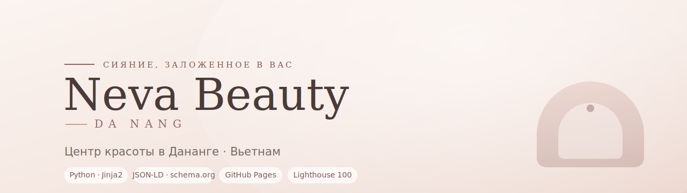
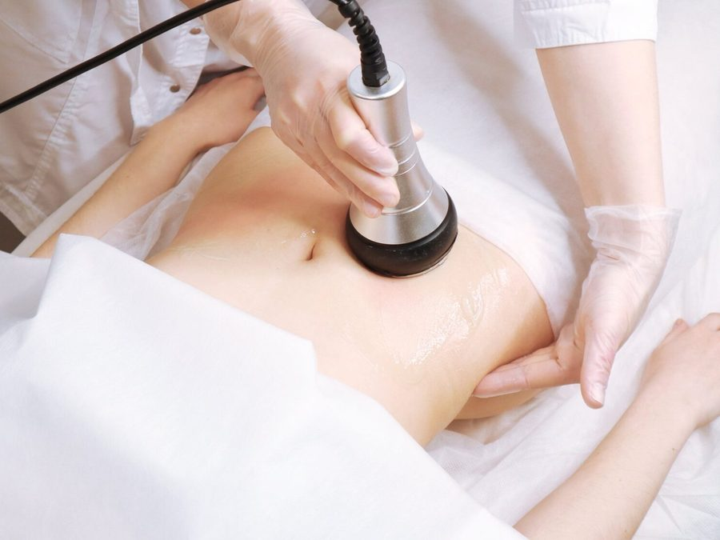
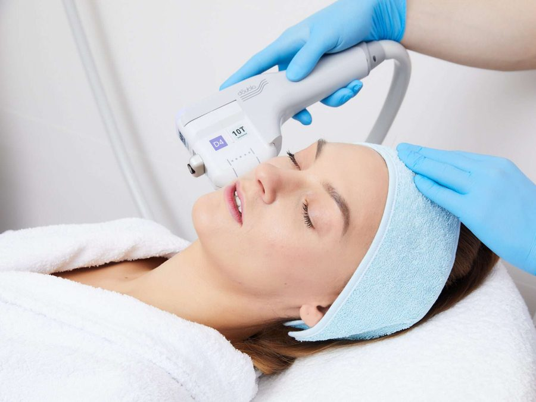
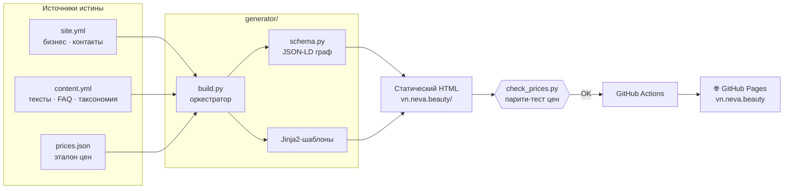

<p align="center">
  
</p>

<p align="center">
  <b>🇷🇺 Русский</b> · <a href="README.en.md">🇬🇧 English</a>
</p>

<p align="center">
  
  
  
  
  
  
</p>

<p align="center">
  🌐 <a href="https://vn.neva.beauty"><b>vn.neva.beauty</b></a> — сайт в продакшене
</p>

---

## О проекте

**Neva Beauty** — сайт центра красоты и аппаратной косметологии в Дананге (Вьетнам).
Обслуживание на русском и английском для русскоязычных клиентов: лазерная эпиляция,
лифтинг и омоложение, коррекция фигуры, уход за лицом.

Технически это **не CMS и не готовый конструктор**, а собственный статический
генератор сайта на Python: контент описан в YAML/JSON, шаблоны — на Jinja2, на выходе —
чистый статический HTML, который бесплатно раздаётся через GitHub Pages на собственном
домене. Весь контент, SEO-разметка и цены собираются из единых источников истины, а
корректность цен защищена автотестом.

<table>
  <tr>
    <td align="center" width="25%">
      <br>
      <sub><b>Коррекция фигуры</b></sub>
    </td>
    <td align="center" width="25%">
      <br>
      <sub><b>Лифтинг и омоложение</b></sub>
    </td>
    <td align="center" width="25%">
      <br>
      <sub><b>Лазерные процедуры</b></sub>
    </td>
    <td align="center" width="25%">
      <br>
      <sub><b>Уход и косметология</b></sub>
    </td>
  </tr>
</table>

---

## 🛠 Технологии

| Область | Инструменты |
|---|---|
| **Язык / сборка** | Python 3.12, собственный генератор `build.py` |
| **Шаблоны** | Jinja2 (наследование, макросы, партиалы) |
| **Данные** | YAML (`site.yml`, `content.yml`) + JSON (`prices.json`) |
| **SEO / данные для ИИ** | JSON-LD (schema.org) `@graph`, `sitemap.xml`, `llms.txt` |
| **Стили** | Чистый CSS, слои по каскаду, минификация `rcssmin` в один бандл |
| **Шрифты** | Самохостинг Cormorant + Manrope (woff2, сабсеты cyrillic/latin) |
| **Графика** | SVG-иконки, `WebP` с `JPG`-фолбэком, декоративный canvas-фон |
| **Тесты** | `check_prices.py` — парити-тест цен на BeautifulSoup4 |
| **Аналитика** | Яндекс.Метрика |
| **CI/CD** | GitHub Actions → GitHub Pages, кастомный домен через `CNAME` |

---

## 🏗 Архитектура

Один проход генератора превращает данные в готовый сайт. Данные, разметка и цены
разделены и имеют единый источник истины; сборка детерминирована и воспроизводима в CI.



---

## ✨ Ключевые инженерные решения

- **🎯 Единый источник истины для контента.** Таксономия направлений задаётся один раз
  в `content.yml`; из неё генератор строит навигацию, хлебные крошки, страницы-разделы
  и перелинковку «Смотрите также» — рассинхрон между разделами невозможен by design.

- **💰 Гарантия точности цен.** `prices.json` — единственный источник цен. После сборки
  `check_prices.py` парсит готовый HTML и сверяет каждую цену с эталоном, падая при
  любом расхождении. Цены никогда не «выдумываются» и не расходятся с прайсом.

- **🔎 Связный граф структурированных данных.** `schema.py` собирает один валидный
  JSON-LD `@graph` (`Organization` + `BeautySalon` + `WebSite`), к которому страницы
  добавляют свои узлы: `Service`, `FAQPage`, `BreadcrumbList`, `ItemList`,
  `AggregateOffer` (диапазон цен считается прямо из прайса).

- **⚡ Оптимизация скорости — Lighthouse 100.** Все CSS-слои склеиваются в один
  минифицированный `bundle.min.css` (один render-blocking запрос вместо шести),
  шрифты самохостятся сабсетами, LCP-изображение прелоадится. Устранён render-blocking:
  прод-показатель вырос с 75 до 100.

- **🌿 Превью и прод из одной сборки.** Параметр `base_path` префиксует ссылки на ассеты
  для превью на GitHub Pages по подпути проекта и остаётся пустым на боевом домене —
  SEO-URL при этом всегда абсолютные. `CNAME` кладётся в артефакт, чтобы деплой не
  сбрасывал кастомный домен.

- **🤖 `llms.txt` для ИИ-ассистентов.** Генератор публикует машиночитаемую карту сайта
  по стандарту [llmstxt.org](https://llmstxt.org) — направления, услуги и контакты.

---

## 📁 Структура проекта

```
.
├─ generator/                 # Статический генератор (Python)
│  ├─ build.py                #   оркестратор сборки
│  ├─ schema.py               #   сборка JSON-LD (schema.org)
│  ├─ check_prices.py         #   парити-тест цен
│  ├─ data/
│  │  ├─ site.yml             #   бизнес, контакты, конфиг
│  │  ├─ content.yml          #   тексты, FAQ, таксономия
│  │  └─ prices.json          #   эталон цен (источник истины)
│  └─ templates/              #   Jinja2-шаблоны и партиалы
│
├─ vn.neva.beauty/            # Сгенерированный сайт (раздаётся GitHub Pages)
│  ├─ index.html · <услуги>/ · <разделы>/
│  ├─ assets/  css · js · fonts · icons · img
│  ├─ sitemap.xml · llms.txt · CNAME · 404.html
│
├─ .github/workflows/deploy.yml   # CI/CD: сборка и деплой
└─ requirements.txt
```

---

## 🚀 Локальный запуск

```bash
# 1. Зависимости
python -m venv .venv && source .venv/bin/activate
pip install -r requirements.txt

# 2. Сборка сайта в vn.neva.beauty/
python generator/build.py

# 3. Проверка точности цен
cd generator && python check_prices.py

# 4. Локальный просмотр
cd ../vn.neva.beauty && python -m http.server 8000
# → http://localhost:8000
```

## ☁️ Деплой

Пуш в `main` запускает GitHub Actions: workflow ставит зависимости, гоняет
`build.py`, публикует папку `vn.neva.beauty/` артефактом и деплоит на GitHub Pages.
Боевой домен `vn.neva.beauty` подключён через `CNAME`.

---

## 🧭 Контент сайта

**4 направления · 10 услуг**, страницы генерируются из таксономии автоматически:

| Направление | Услуги |
|---|---|
| **Коррекция фигуры** | LPG-массаж · эндосфера-терапия · УЗ-кавитация |
| **Лифтинг и омоложение** | SMAS-лифтинг · Morpheus 8 (RF) · фотоомоложение M22 |
| **Лазерные процедуры** | лазерная эпиляция · удаление тату · удаление перманента |
| **Уход и косметология** | эстетическая косметология и уход |

---

<p align="center">
  <sub>Разработка и дизайн — портфолио-проект. Изображения процедур — материалы центра.</sub><br>
  <sub>Фото в шапке (hero): Adrian Motroc / Unsplash.</sub>
</p>
