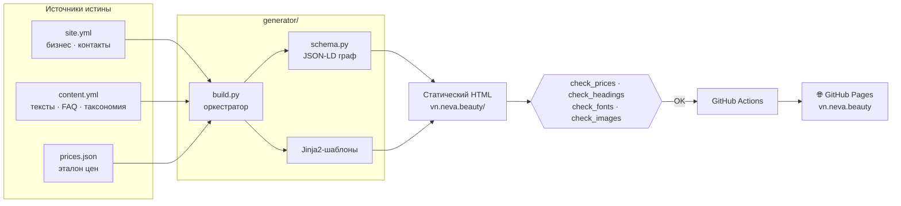

<p align="center">
  
</p>

<p align="center">
  <b>🇷🇺 Русский</b> · <a href="README.en.md">🇬🇧 English</a>
</p>

<p align="center">
  🌐 <a href="https://vn.neva.beauty"><b>vn.neva.beauty</b></a> — сайт работает
</p>

---

## Сайт центра красоты: переходов в мессенджер стало в 5,75 раза больше

**Neva Beauty** — центр красоты и аппаратной косметологии в Дананге, Вьетнам:
лазерная эпиляция, лифтинг и омоложение, коррекция фигуры, уход за лицом.
Клиенты — русскоязычные люди, живущие во Вьетнаме, приём по записи,
обслуживание на русском и английском.

Раньше центр работал на сайте-конструкторе: его почти не находили в поиске,
а из тех, кто заходил, написать решались единицы. Этот сайт собран с нуля,
чтобы исправить и то, и другое.

<table>
  <tr>
    <td align="center" width="25%">
      <br>
      <sub><b>Коррекция фигуры</b></sub>
    </td>
    <td align="center" width="25%">
      <br>
      <sub><b>Лифтинг и омоложение</b></sub>
    </td>
    <td align="center" width="25%">
      <br>
      <sub><b>Лазерные процедуры</b></sub>
    </td>
    <td align="center" width="25%">
      <br>
      <sub><b>Уход и косметология</b></sub>
    </td>
  </tr>
</table>

---

## 📈 Что изменилось

Два одинаковых по длине периода: старый сайт на конструкторе и новый.

**Переходы в мессенджер — главное:**

| Показатель | Старый сайт<br><sub>1 апр — 7 мая 2026</sub> | Новый сайт<br><sub>1 авг — 6 сен 2026</sub> |
|---|---|---|
| **Визитов с переходом в мессенджер** | **8** | **46** |
| **Доля визитов с переходом** | **2,5 %** | **8,8 %** |
| Кликов в WhatsApp и Telegram | 13 | 54 |

**Переходов в мессенджер в 5,75 раза больше, а доля выросла в 3,5 раза.** Второе важнее
первого: сайт стал втрое лучше превращать зашедшего в написавшего.

**Откуда пришли люди:**

| Показатель | Старый сайт | Новый сайт |
|---|---|---|
| **Визитов из поиска** | **30** | **256** |
| Доля поиска в трафике | 9 % | 49 % |
| Всего визитов | 322 | 520 |
| Просмотров страниц | 603 | 1 187 |
| Страниц за визит | 1,87 | 2,28 |
| Время на сайте | 1:23 | 1:36 |

Поисковый трафик вырос в 8,5 раза — поиск из последнего канала стал первым.

Честная оговорка: в новом периоде параллельно работала реклама, она дала
86 визитов (16 % трафика) — треть от того, что принёс поиск. Рекламой этот рост
не объясняется: даже без неё неплатный трафик вырос с 322 до 434.

Два показателя изменились не в лучшую сторону. Отказы выросли с 17 % до 25 % —
раньше почти все приходили из соцсетей, уже зная центр, теперь половина трафика
это холодный поиск. Переходы в соцсети просели с 8,4 % до 5,0 %: раньше сайт
работал витриной, с которой уходили дописываться в Instagram, теперь пишут
напрямую в мессенджер.

<sub>Источник цифр — Яндекс.Метрика центра: переходы считает автоцель «переход
в мессенджер», она ловит клики по всем ссылкам на WhatsApp и Telegram и работала
в обоих периодах. Сколько из этих людей дошли до записи и до денег, Метрика
не знает. Скорость и доступность — Lighthouse 12 по боевому домену.</sub>

---

## 🎯 Что сайт решает для бизнеса

**Каждая услуга ищется отдельно.** Четыре направления, десять услуг, у каждой
своя страница с описанием, ценами и ответами на частые вопросы. На запрос
«SMAS-лифтинг Дананг» есть ровно та страница, которую человек искал, — а не
строчка в общем списке.

**Написать можно с любой страницы.** Блок записи стоит на странице каждой
услуги со своим заголовком — человек, читающий про лазерную эпиляцию, пишет
прямо отсюда, не разыскивая контакты по сайту. Телефон из контактной панели
убран: клиенты салона пишут, а не звонят.

**Поисковик понимает, что это салон.** На каждой странице служебная разметка,
которая сообщает роботам: это центр красоты в Дананге, вот услуги, вот цены
в донгах, вот ответы на вопросы. Из этого Google и Яндекс собирают развёрнутые
карточки в выдаче. Сайт понятен и ИИ-ассистентам — для них публикуется
отдельная машиночитаемая карта.

**Быстро на телефоне.** Страницы собраны заранее и отдаются готовыми, без базы
данных и движка. Сайт открывается почти мгновенно даже с телефона на слабом
интернете: по замеру Google скорость выросла с 75 до 98 из 100. Страницы читаются
экранной лупой и голосовым помощником, а поисковик разбирает их без единой
претензии — по 100 из 100. И страница не «прыгает» при загрузке: палец
не промахивается мимо кнопки.

**Цены не могут разойтись с прайсом.** Все цены живут в одном файле. Перед
каждой публикацией автоматика сверяет с ним каждую цифру на сайте — и если
хоть одна разошлась, сайт просто не выходит в продакшен. Неверная цена на сайте
для салона — это либо потерянные деньги, либо неприятный разговор на ресепшене.

**Два салона связаны.** У бренда есть вторая точка на Самуи
([th.neva.beauty](https://th.neva.beauty)). Сайты устроены одинаково
и переключаются друг на друга: человек, попавший в поиске не в ту страну,
уходит на нужный сайт, а не закрывает вкладку.

---

## 💰 Что стоит владельцу

| | |
|---|---|
| **Хостинг** | 0 — статические страницы раздаются бесплатно |
| **Абонентская плата за конструктор** | нет |
| **Обновление цен** | правка одной строки, сайт пересобирается и проверяет себя сам |
| **Новая услуга** | две строчки в одном файле — сама услуга и её место в разделе; страница, меню, хлебные крошки и разметка появляются сами |
| **Срок жизни** | нет базы, плагинов и движка, которые нужно обновлять; со временем стареет только сборщик, применяющий правки |

---

## 🧭 Что на сайте

**4 направления · 10 услуг**, страницы генерируются из таксономии автоматически:

| Направление | Услуги |
|---|---|
| **Коррекция фигуры** | LPG-массаж · эндосфера-терапия · УЗ-кавитация |
| **Лифтинг и омоложение** | SMAS-лифтинг · Morpheus 8 (RF) · фотоомоложение M22 |
| **Лазерные процедуры** | лазерная эпиляция · удаление тату · удаление перманента |
| **Уход и косметология** | эстетическая косметология и уход |

---

<details>
<summary><b>🔧 Как это устроено — техническая документация</b></summary>

<p>
  
  
  
  
  
</p>

Технически это **не CMS и не готовый конструктор**, а собственный статический
генератор сайта на Python: контент описан в YAML/JSON, шаблоны — на Jinja2,
на выходе — чистый статический HTML, который бесплатно раздаётся через
GitHub Pages на собственном домене. Весь контент, SEO-разметка и цены собираются
из единых источников истины, а корректность цен защищена автотестом.

### 🛠 Технологии

| Область | Инструменты |
|---|---|
| **Язык / сборка** | Python 3.12, собственный генератор `build.py` |
| **Шаблоны** | Jinja2 (наследование, макросы, партиалы) |
| **Данные** | YAML (`site.yml`, `content.yml`) + JSON (`prices.json`) |
| **SEO / данные для ИИ** | JSON-LD (schema.org) `@graph`, `sitemap.xml`, `llms.txt` |
| **Стили** | Чистый CSS, слои по каскаду, минификация `rcssmin` в один бандл |
| **Шрифты** | Самохостинг Cormorant + Manrope (вариативные woff2, сабсеты cyrillic/latin) |
| **Графика** | SVG-иконки, `WebP` с `JPG`-фолбэком, декоративный canvas-фон |
| **Тесты** | `check_prices.py` — парити-тест цен, `check_headings.py` — иерархия заголовков (BeautifulSoup4), `check_fonts.py` — покрытие шрифтов, `check_images.py` — целостность картинок |
| **Аналитика** | Яндекс.Метрика |
| **CI/CD** | GitHub Actions → GitHub Pages, кастомный домен через `CNAME` |

### 🏗 Архитектура

Один проход генератора превращает данные в готовый сайт. Данные, разметка и цены
разделены и имеют единый источник истины; сборка детерминирована и воспроизводима в CI.


```mermaid
flowchart LR
    subgraph SRC["Источники истины"]
        A["site.yml<br/>бизнес · контакты"]
        B["content.yml<br/>тексты · FAQ · таксономия"]
        C["prices.json<br/>эталон цен"]
    end
    subgraph GEN["generator/"]
        D["build.py<br/>оркестратор"]
        E["schema.py<br/>JSON-LD граф"]
        F["Jinja2-шаблоны"]
    end
    A --> D
    B --> D
    C --> D
    D --> E
    D --> F
    E --> G["Статический HTML<br/>vn.neva.beauty/"]
    F --> G
    G --> H{{"check_prices · check_headings<br/>check_fonts · check_images"}}
    H -->|OK| I["GitHub Actions"]
    I --> J["🌐 GitHub Pages<br/>vn.neva.beauty"]
```

### ✨ Ключевые инженерные решения

- **🎯 Единый источник истины для контента.** Таксономия направлений задаётся один раз
  в `content.yml`; из неё генератор строит навигацию, хлебные крошки, страницы-разделы
  и перелинковку «Смотрите также» — рассинхрон между разделами невозможен by design.

- **💰 Гарантия точности цен.** `prices.json` — единственный источник цен. После сборки
  `check_prices.py` парсит готовый HTML и JSON-LD и сверяет с эталоном не только цифру,
  но и раздел прайса, описание позиции и валюту, падая при любом расхождении. Шаг
  встроен в деплой: расхождение в ценах не доезжает до прода. Непонятная форма цены
  в прайсе роняет сборку, а не «вырезает цифры» — числа не выдумываются никогда.

- **♿ Структура страницы под автотестом.** `check_headings.py` в том же шаге деплоя
  проверяет иерархию заголовков: ровно один `h1`, уровни без пропусков. Пропуск
  (`h1 → h3`) на экране не виден, но ломает навигацию скринридером по заголовкам
  и валидность — три страницы прожили с ним незамеченными.

- **🔤 Покрытие шрифтов и целостность картинок под автотестом.** Шрифты подрезаны
  под нужный набор знаков, поэтому новая буква в тексте отрисовалась бы системным
  шрифтом — `check_fonts.py` ловит это до прода. `check_images.py` проверяет пути
  и адаптивные наборы: сорвавшийся hero главной однажды не догрузился во встроенном
  браузере Instagram, и глазами такое видно, только если знать, куда смотреть.

- **🔎 Связный граф структурированных данных.** `schema.py` собирает один валидный
  JSON-LD `@graph` (`Organization` + `BeautySalon` + `WebSite`), к которому страницы
  добавляют свои узлы: `Service`, `FAQPage`, `BreadcrumbList`, `ItemList`,
  `AggregateOffer` (диапазон цен) и `OfferCatalog` — каждая позиция прайса как `Offer`
  с ценой числом, чтобы связь «услуга → цена» читалась поисковиками и ИИ-ассистентами
  однозначно. Надбавки к процедурам («+350 000 đ») в диапазон цен не входят: иначе
  он занижал бы стоимость услуги до цены доплаты.

- **⚡ Оптимизация скорости.** Все CSS-слои склеиваются в один минифицированный
  `bundle.min.css` (один render-blocking запрос вместо шести), шрифты самохостятся
  сабсетами, LCP-изображение прелоадится. Шрифты вариативные: один файл на сабсет
  покрывает все начертания — 4 запроса и 94 КБ вместо 10 запросов и 209 КБ, которые
  уходили на повторную загрузку одних и тех же байтов под именами с разным весом.
  Метрики системной подложки выровнены по фирменным шрифтам (`size-adjust`,
  `ascent-override`), поэтому на медленной сети страница не прыгает при подмене.
  Устранение render-blocking подняло Performance на проде с 75 до 98. Замер боевого
  домена (Lighthouse 12, мобильный и десктоп): Accessibility 100, SEO 100,
  Performance 94–98, CLS 0. Best Practices — 78: это сторонние куки Яндекс.Метрики,
  осознанная цена подключённой аналитики.

- **🌿 Превью и прод из одной сборки.** Параметр `base_path` префиксует ссылки на ассеты
  для превью на GitHub Pages по подпути проекта и остаётся пустым на боевом домене —
  SEO-URL при этом всегда абсолютные. `CNAME` кладётся в артефакт, чтобы деплой не
  сбрасывал кастомный домен.

- **🤖 `llms.txt` для ИИ-ассистентов.** Генератор публикует машиночитаемую карту сайта
  по стандарту [llmstxt.org](https://llmstxt.org) — направления, услуги и контакты.

### 📁 Структура проекта

```
.
├─ generator/                 # Статический генератор (Python)
│  ├─ build.py                #   оркестратор сборки
│  ├─ schema.py               #   сборка JSON-LD (schema.org)
│  ├─ check_prices.py         #   парити-тест цен
│  ├─ check_headings.py       #   проверка иерархии заголовков
│  ├─ check_fonts.py          #   покрытие сабсетов шрифтов
│  ├─ check_images.py         #   целостность картинок и srcset
│  ├─ make_brand_assets.py    #   разовая генерация фавиконов и превью из логотипа
│  ├─ data/
│  │  ├─ site.yml             #   бизнес, контакты, конфиг
│  │  ├─ content.yml          #   тексты, FAQ, таксономия
│  │  └─ prices.json          #   эталон цен (источник истины)
│  └─ templates/              #   Jinja2-шаблоны и партиалы
│
├─ vn.neva.beauty/            # Сгенерированный сайт (раздаётся GitHub Pages)
│  ├─ index.html · <услуги>/ · <разделы>/
│  ├─ assets/  css · js · fonts · icons · img
│  ├─ favicon.svg · favicon.ico · apple-touch-icon.png · icon-192/512.png
│  ├─ sitemap.xml · llms.txt · site.webmanifest · CNAME · 404.html
│
├─ .github/workflows/deploy.yml   # CI/CD: сборка и деплой
└─ requirements.txt
```

### 🚀 Локальный запуск

```bash
# 1. Зависимости
python -m venv .venv && source .venv/bin/activate
pip install -r requirements.txt

# 2. Сборка сайта в vn.neva.beauty/
python generator/build.py

# 3. Проверки перед публикацией
cd generator && python check_prices.py && python check_headings.py \
  && python check_fonts.py && python check_images.py

# 4. Локальный просмотр
cd ../vn.neva.beauty && python -m http.server 8000
# → http://localhost:8000
```

Фавиконы, иконки приложения и карточка превью ссылок собраны из логотипа заранее
и лежат в репозитории — обычная сборка их не трогает. Пересобрать нужно только при
смене логотипа (нужны Pillow и macOS: карточку рисует системный `qlmanage`):

```bash
python generator/make_brand_assets.py
```

### ☁️ Деплой

Пуш в `main` запускает GitHub Actions: workflow ставит зависимости, гоняет
`build.py`, прогоняет автотесты (цены, заголовки, шрифты, картинки), публикует
папку `vn.neva.beauty/` артефактом и деплоит на GitHub Pages.
Боевой домен `vn.neva.beauty` подключён через `CNAME`.

</details>

---

<p align="center">
  <sub>Разработка и дизайн — jw-dev.pro. Изображения процедур — материалы центра.</sub><br>
  <sub>Фото в шапке (hero): Adrian Motroc / Unsplash.</sub>
</p>
